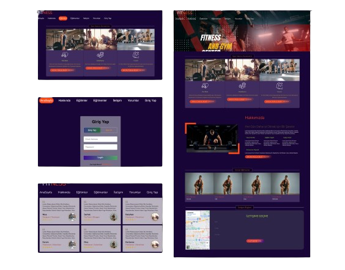

# 🥊 Fitness-Website-Design

• Responsive  Fitness Website Design.
 
• Made using HTML,CSS,JS.
 
• There is a login and registration page.
 
• There is a page with an About Me section that provides information about the site.

